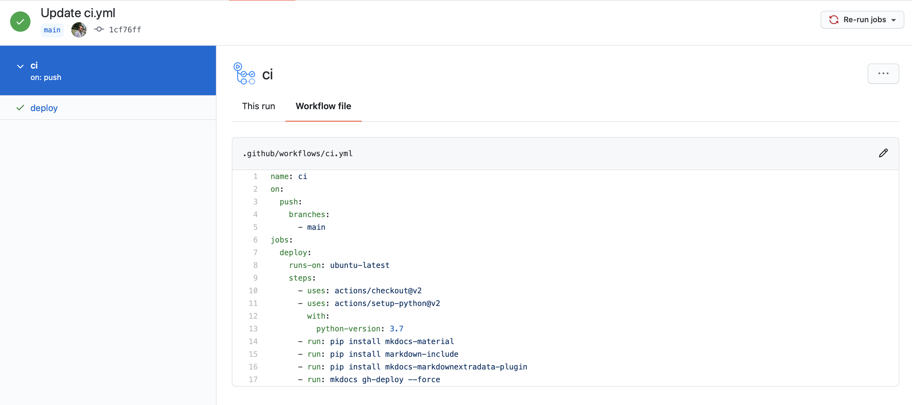
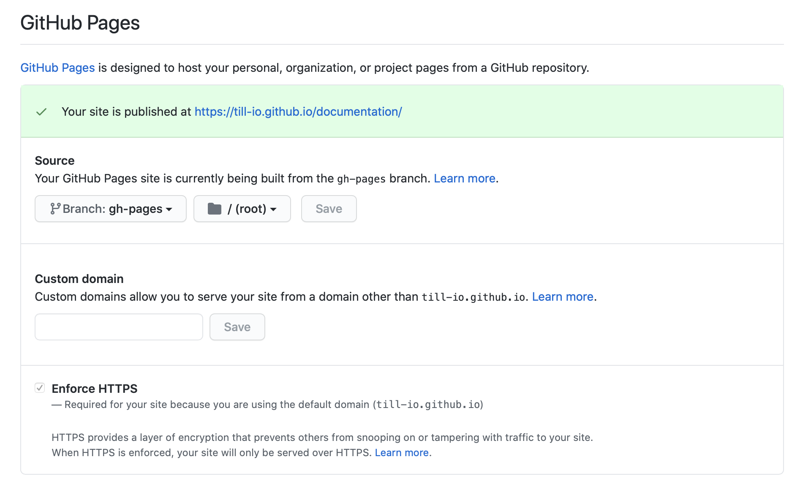

# Documentation

This repo contains all the documentation for the <code>till</code> software universe. The side is built with <code>mkdocs</code> material by <a href="https://github.com/squidfunk">squidfunk</a>. <code>mkdocs</code> is an amazing setup that allows you to create super clean and nice technical documentations within a couple of minutes.

## Setup

I know, documentation is not the most fun task, however, with a lightweight and nice setup it is actually quite fun. As I already mentioned, I am using <code>mkdocs</code> to setup the website. I am hosting the website, using GitHub Pages. Which again, is incredibly simple.

To publish the website, I am using GitHub Actions. I setup a simple workflow that allows me to publish a new side, with every push to the main branch. The workflow looks like that:

  

This workflow simply installs the necessary dependencies to run my mkdocs documentation. The workflow is automatically triggered with every push to the main branch, however, you can also run this manually, if you like. When you run this workflow for the first time, you will need to direct GitHub pages to the correct branch, which is <code>gh-pages</code>. This branch gets automatically created, so you don't have to do that. Just select this branch and <code>root</code> as the directory and hit save.

  

